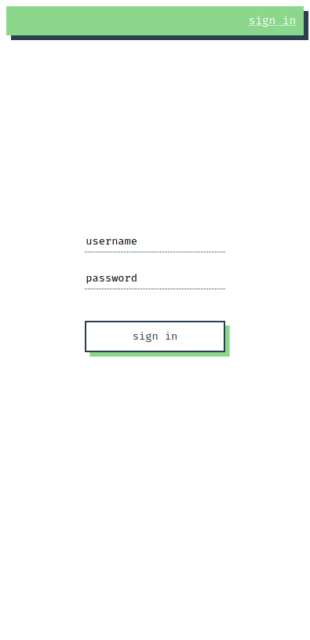
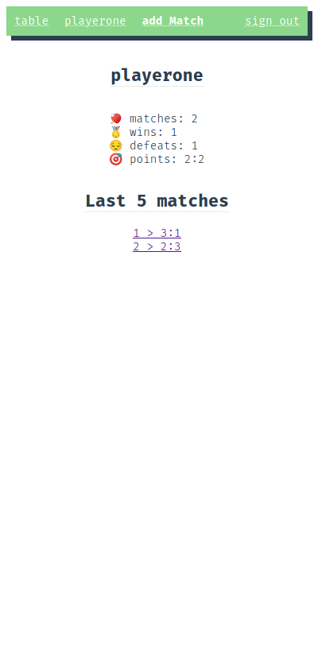
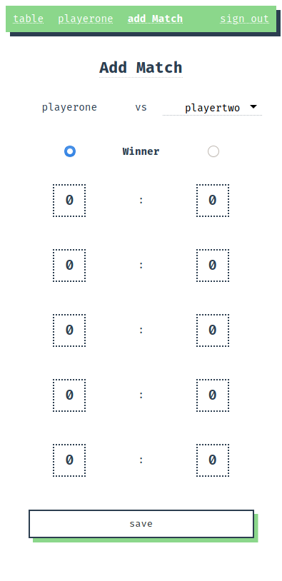

# 🏓 TTT > TableTennisTournament

  

## 🖥️ > HOW TO RUN

1. `git clone https://github.com/justpeterpan/ping-pong.git`
2. `./install.sh` (optional)
3. `./start.sh`
4. `docker exec -i pp-api /bin/sh < ./migrate.sh`
5. `http://localhost:8080`

## 📝 > TODO

- [x] Dockerize backend & frontend
